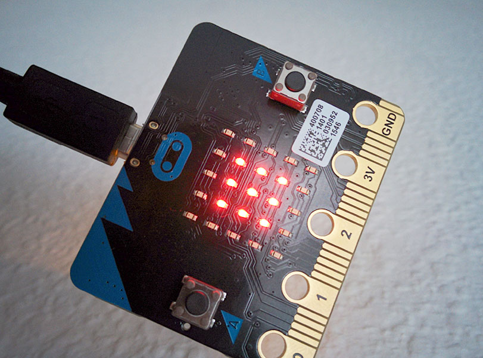

# PomodoroBit
This MicroPython project implements the Pomodoro timer for BBC micro:bit controller. Pomodoro timer is a technique to organize your time and minimize distractions by working 25-minute slots on a single task without switching the context. PomodoroBit measures your time and displays on the LED matrix how much time has elapsed since the beginning of the task. If shaken, PomodoroBit displays in text how many pomodoros have been successfully completed since the timer has been activated.

# Preview

# Links
[micro:bit](http://microbit.org)

[MicroPython](https://micropython.org)

[Python for micro:bit](https://microbit-micropython.readthedocs.io/en/latest/tutorials/introduction.html)

[Online micro:bit Python editor](https://www.microbit.co.uk/app)

[Pomodoro Technique](https://en.wikipedia.org/wiki/Pomodoro_Technique)
